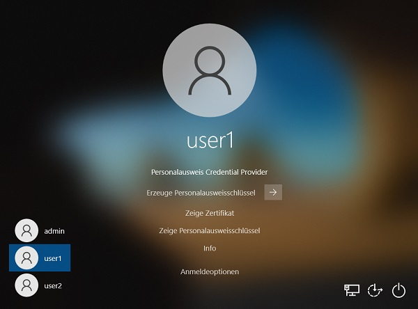

# PersonalausweisV2CredentialProvider
This Credential Provider for Windows 10 generates a hash-key from personalausweis-data for Windowslogin  

Version: 0.4  
Author: buergerservice.org e.V. <KeePerso@buergerservice.org>  




-------------
requirements:
-------------
Windows 10  
Personalausweis Credential Provider (= dll-file)  
program setuserregistry.exe for the admin  
a 64bit Computer cause this Plugin is 64bit,  
Visual C++ Redistributable for Visual Studio 2015/2017/2019,  
AusweisApp2 (installed for all users)  
cardreader  
for online identification ready Personalausweis - you can test it in AusweisApp2 with "Meine Daten einsehen"  
internetaccess  


-------------
installation:
-------------
the installation is done by the admin.  
before you begin be sure you have all hashkeys of all users. the hashkeys you can get from  
workflowClient.exe <PIN>  
the hashkey is shown at the end.  

Please copy the dll-file to ..windows/system32  
then click the registerfile register_PersonalausweisV2CredentialProvider.reg  
the register will create a new registry-directory  

the admin starts the program 
```
setuserregistry.exe user hashkey <optional>userpassword  
```
the parameter:  
user - the windowsusername like admin, user1...  
hashkey - the hashkey of user  
userpassword - this is optional - if the admin types no userpassword a userpassword  
	       with length 8 (uppercase, lowercase, number, specialsign) is generated  
the output is written to the registry under HKEY_LOCAL_MACHINE\SOFTWARE\buergerservice.org e.V.\PersonalausweisCredentialProvider\keys  
for every username is a directory/key and the program writes 5 data. Please check if for every user there are the  
5 data. (Standard) not counted.  
if the admin wants more security he can change the authority for the directory from "for all users" only for the user -  
the authority for system and admin etc of course unchanged.  


if theres a problem:  
if something doesnt work admin can start the safemode for Windows 10 and you get your password login  
and delete the dll file from windows/system32  
and click the unregister-file Unregister_PersonalausweisV2CredentialProvider.reg  


Link to Programme:  
if you installed your AusweisApp2 in a directory within german name "Programme" you can use the batch makelinkProgramme  
to link it to a "Programs" link, cause otherwise windows dont find AusweisApp2 for starting.  
Microsoft wrote:  
https://support.microsoft.com/de-de/topic/der-ordner-c-programme-kann-in-der-deutschen-version-von-windows-vista-oder-windows-7-nicht-ge%C3%B6ffnet-werden-24b333e7-1624-3a21-b2f3-0fa82548e0ee#bkmk_fixitformealways


Disable Credential Provider:  
under method 2 Microsoft writes how to disable additional credential providers for example the passwordprovider   
(in safemode the passwordprovider is still there for the admin).  
you have to create a new DWORD32bit-value with name Disabled with value 1  
https://social.technet.microsoft.com/Forums/windows/de-DE/9c23976a-3e2b-4b71-9f19-83ee3df0848b/how-to-disable-additional-credential-providers?forum=w8itprosecurity


-----------
how to use:
-----------
install Credential Provider - see part installation above  
check in regedit if there is HKEY_LOCAL_MACHINE\SOFTWARE\buergerservice.org e.V.\PersonalausweisCredentialProvider\keys  
with directories for the users and the hashes and so on in them.  
connect your cardreader and put Personalausweis on it.  
start your Windows 10.  
in "Anmeldeoptionen" click on the sign of Personalausweis Credential Provider.  
If everything is ready (connected cardreader, Personalausweis lying on the cardreader, internet online)  
click on "Erzeuge Personalausweisschlüssel".  
if you have a cardreader without keypad then a window for the PIN should pop up.  
then starts the selfauthentication. After that a key is produced.   
close the window with ok and submit with click on "Übermitteln"-Button.  
if everything works you login. if there is a problem the admin can start the safemode and click unregister.reg   
and delete dll under windows/system32  


----------------------------
known problems and questions
----------------------------


is my PIN safe?  
	- the PIN is only sent to AusweisApp2 and not stored. you can use a cardreader with keypad, then the plugin cant see the PIN.  

what data of my Personalausweis is used for the key?  
	like you can see in the source used are this data  
	FamilyNames (or BirthName if set)  
	GivenNames  
	DateOfBirth  
	PlaceOfBirth  

is an attackscenario possible where someone takes the source and builds a new Credential Provider where the data are not read  
from Personalausweis and the attacker writes them direct in the code and generates the key?  
	yes theoretical, but first he also must know the adminpassword and second if the admin keeps his pc safe noone can install  
	a attackerplugin or copy the database  

the Credential Provider is crashing (always starting and starting like flickering):  
	if something doesnt work admin can start the safe mode for Windows 10 and you get your password login  
	and delete the dll file from windows/system32  
	and click the unregister-file Unregister_PersonalausweisV2CredentialProvider.reg  

---------------
versionhistory:
---------------
0.4 new errormessages  
0.3 new button "Zeige Personalausweisschlüssel"  
0.2 AusweisApp2 in background killed before login  
0.1 start pilotversion  


-----
build
-----
source was build with Visual Studio 2019  
it was build on base of the official Microsoft sample for Windows V2 credential provider  
the best website for the sample and other sources is:  
https://github.com/DavidWeiss2/windows-Credential-Provider-library  

as library we use our own workflowLibrary for connection to AusweisApp2  
and for use of OpenSSL for hash and encrypt/decrypt passwords in registry.  
https://github.com/eiddeveloper/workflowLibrary  


--------------
setuserregisty
--------------
setuserregistry is a console application that is used for register the userdata in the windowsregistry,  
like in the installation written obove.  

usage:  
```
setuserregistry.exe user hashkey <optional>userpassword  
```
user - the windowsusername like admin, user1...  
hashkey - the hashkey of the user  
userpassword - this is optional - if the admin types no userpassword a userpassword   
	       with length 8 (uppercase, lowercase, number, specialsign) is generated  


